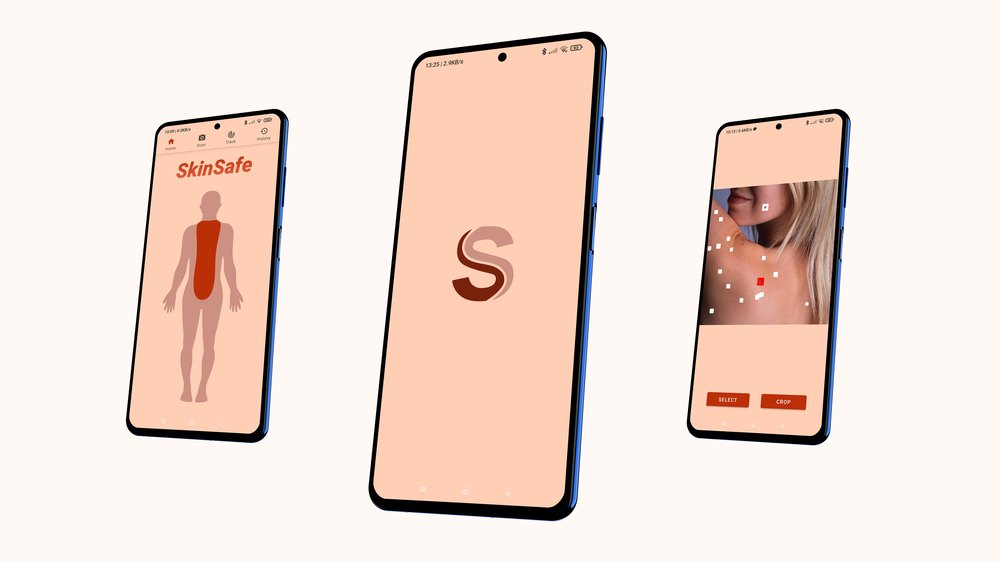

## SkinSafe by Scrip0

**SkinSafe** is a project that allows you to **monitor your skin health** and not stress about any manifestations on the skin. A built-in **neural network** will detect one of the 6 most frequent illnesses and give you statistics. You may also track them using a **convenient tracking system**.

|  |  |  |  |
| :---: | :---: | :---: | :---: |
|  |  |  |  |
|  |  |  |  |

## About

SkinSafe was started as an **application for HackUMass** (48 hr hackathon) and later was developed into **fully functional application**.

SkinSafe uses precise **Convolutional Neural Network** to recognise among several types of skin diseases. Link to **ML model**: https://colab.research.google.com/drive/1VKr5pJo-kZvsCNNsg-VLdZ_A3OcuppbR?usp=sharing.

**Google Play Store** link: https://play.google.com/store/apps/details?id=com.skinsafe.skinsafe.

## Technologies
- Java
- Python
- TensorFlow
- Android Studio
- Jupyter Notebook
- Room Local DB
- Material Design
- Convolutional Neural Networks
